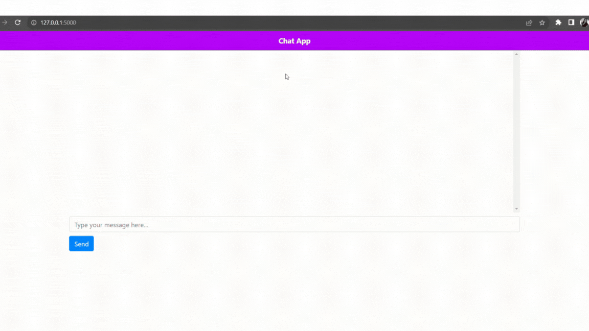

OpenAI Integrated Chatbot Application

Project Overview

This project presents a cutting-edge web application harnessing the capabilities of OpenAI's language model to introduce an interactive chatbot tailored for an internet service provider. The chatbot is meticulously crafted to assist users with inquiries about internet plans, deliver pertinent information, and create a personalized user experience.

Technologies Used

1. Flask:
   

Flask, a lightweight web application framework for Python, is utilized to handle HTTP requests, render HTML templates, and structure the web application.

2. OpenAI API:

   
The OpenAI API is leveraged to generate responses for user messages. This API provides state-of-the-art natural language processing models.

3. HTML and Jinja Templates:
4. 

HTML templates with Jinja, a template engine for Python integrated into Flask, are used to render dynamic content.

4. Python:

The core language used to write the application logic, handle user input, and interact with the OpenAI API.

5. RESTful API:

The application follows RESTful principles, using different routes for different functionalities, especially for handling user messages.

Key Features

1. User-Friendly Chat Interface:

   

The application boasts an intuitive chat interface, ensuring seamless interaction with the chatbot.

2. Predefined Conversation Flow:

The chatbot follows a scripted conversation flow, guaranteeing a friendly and informative interaction with users.

3. Integration with OpenAI:

The core of the chatbot is powered by OpenAI's advanced language model, facilitating the generation of contextually appropriate responses to user queries.

Usage Instructions

Repository Setup:

git clone <repository_url>

Virtual Environment Activation:

On Windows:

.\venv\Scripts\activate

On macOS/Linux:

source venv/bin/activate

OpenAI API Key Configuration:

Substitute 'your_API_key' with your actual OpenAI API key in the app.py file.

Flask Application Execution:

python app.py
Chat Interface Access:
Launch a web browser and navigate to http://localhost:5000.

Important Considerations
1. Security Precautions:

Safeguard your OpenAI API key to prevent public exposure.
2. Customizability:

Tailor the conversation script and prompts within the codebase to align with specific business objectives.
Potential Business Impact
The integration of a chatbot into a business website can yield substantial benefits:

Improved Customer Engagement:

The chatbot provides an interactive and engaging platform for website visitors.
Streamlined Customer Support:

By addressing frequently asked questions, the chatbot can alleviate the workload of human customer support representatives.
Round-the-Clock Availability:

The chatbot ensures uninterrupted user assistance, even beyond standard business hours.
Personalized User Interactions:

The chatbot's responses can be customized to reflect your brand’s voice, delivering a personalized user experience.
This README provides a detailed guide on project setup, key features, usage, and potential business impact.

